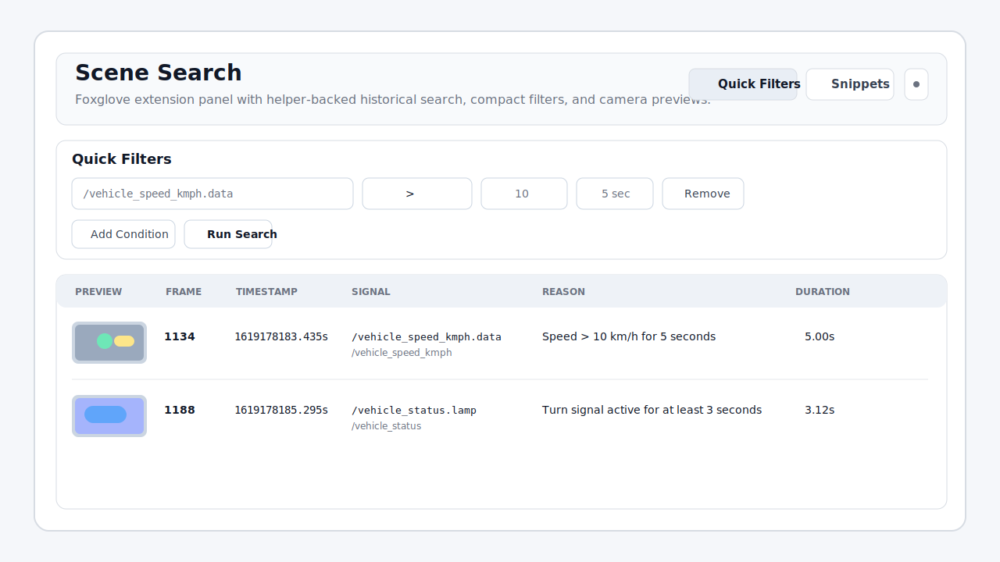
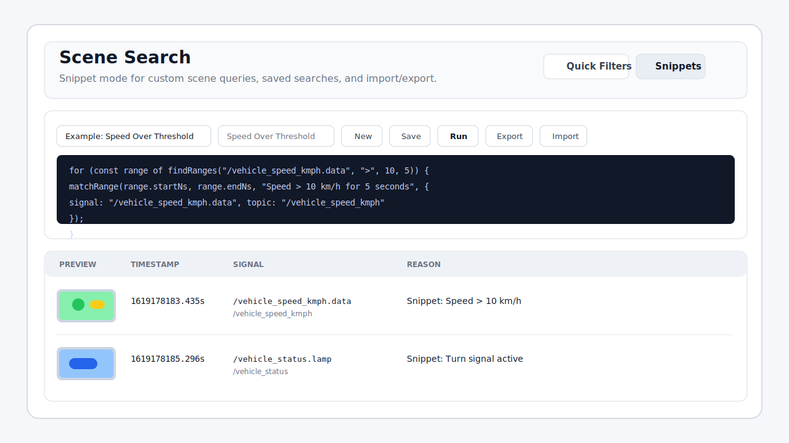

<p align="center">
  
</p>

<p align="center">
  
</p>

# cap

`cap` is a Foxglove extension plus a lightweight local helper for historical bag search.

It helps users open a recording, search for scenes with quick filters or snippets, and jump straight to the matching timestamp with optional camera previews.

## More Views





## Does It Adjust To Different Bags?

Yes, for supported recordings.

When a user opens a different bag, `cap` reads the topic list from Foxglove, asks the local helper to match that recording, then reloads the topic, signal, and camera metadata for that file. That means:

- the quick-filter signal list updates automatically
- camera topic choices update automatically
- snippets still work, but they need to reference signal names that exist in the currently opened recording

## Supported Formats

- ROS bag: supported
- MCAP: not supported yet in this build

## Quick Start

```powershell
npm install
npm run build
npm run package
npm run serve-index -- "C:\Users\you\Downloads"
```

Then load the packaged `.foxe` into Foxglove and open a supported bag.

## Manual Index Build

```powershell
npm run index-bag -- "C:\path\to\recording.bag" -o "C:\path\to\recording.bag.cap-index.json"
```

## Demo Data

Foxglove's official docs point users to its sample data gallery when they want example recordings. Those datasets are useful for testing, but they are usually too large or awkward to bundle into a public repo.

If an official sample bag is too big, the best alternatives are:

1. Use a tiny derived dataset or mock JSON modeled after the sample recording
2. Trim a recording down to a very short slice for demos only
3. Host larger demo assets separately and load them on demand

## Repo Notes

- Generated `.foxe` bundles are ignored
- Local bag files and generated indexes are ignored
- Suggested GitHub repo description and topics are in `.github/repository-metadata.md`

## Limitations

- MCAP indexing is not implemented yet
- Camera previews currently rely on sparse previews from `sensor_msgs/CompressedImage`
- Historical search depends on the local helper, not the extension alone
